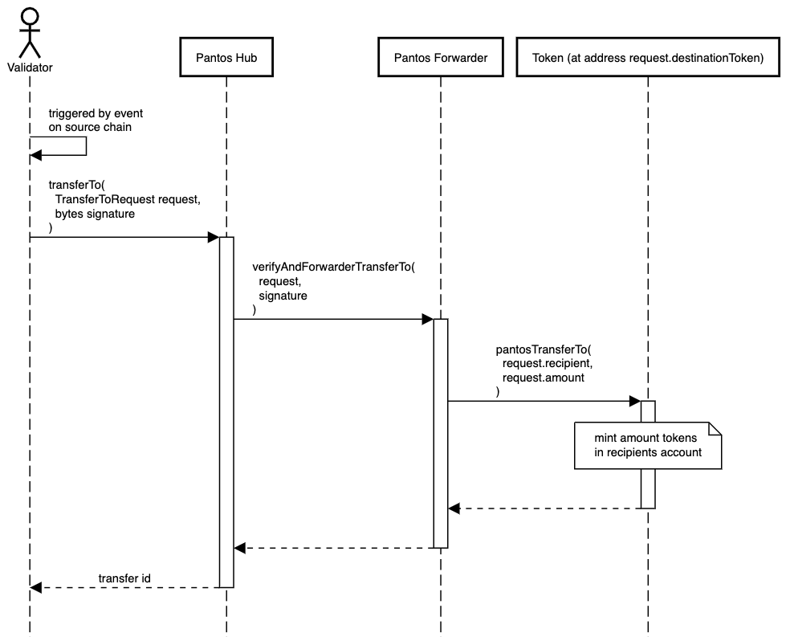

# Token Transfer

## On-Chain Transfer

The Pantos protocol allows the transfer of assets on-chain and cross-chain. To move assets on the same blockchain (no cross-chain transfer), a user has to create a `TransferRequest`, sign it, and send it to a service node.&#x20;

The service node uses the transfer function of the Pantos Hub to perform the transfer.\

**The following figure shows how an on-chain transfer is executed and what entities are involved:**

<figure><figcaption></figcaption></figure>

## Cross-Chain Transfer

If a user wants to transfer a token from a source chain to a destination chain, they must create a `TransferFromRequest`, sign it, and submit it to a service node. The service node will use the `transferFrom` function of the Pantos Hub contract on the source chain.\

**The following figure shows the steps and entities involved in a cross-chain transfer on the source chain:**

<figure><figcaption></figcaption></figure>

As soon the transaction on the source chain is successful, an event is emitted. The Validator is listening to such `transferFrom` events and once it hears one, it creates `TransferToRequest` and forwards it to the Pantos Hub contract using the `transferTo` function. Once this transaction has been successful, the cross-chain asset transfer has been successful.\

**The following figure shows the steps and entities involved in executing the cross-chain transfer on the destination chain:**

<figure><figcaption></figcaption></figure>
